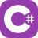
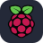

# Projects and school

## 👋 Hello, wondering who I am?
- I am a student studying computer science
- I live in northern Italy
- I also Code in my freetime for fun
- I can Code in a variety of languages and currently I work on some Flutter apps
- I like tinkering a lot with electronics, also in combination with 3D-printing
- Currently working on diffrent projects
 

#### Looking for a fun way to get to know me better?  Try this [link](https://le0nyx.github.io/Le0nyx/)

 

  
  
  
  
  
  
  
  
  
  
  
  
  
  
  
  
  
  
  
  
  
  
  
  
  
  
  

## 📌 What is this repository about?
This repository is my resume and a collection of smaller personal projects that I coded at home for fun and to make easier certain tasks, such as a menu that opens on boot for different scenarios, and Arduino code for automation as well as that controls a little self made clock on my desk and some One-Day projects that I made for getting to know a language or some functions. Please also check out my biggest Project yet, called [Project Raven](https://github.com/Le0nyx/Project-Raven) or [Mobile Ollama](https://github.com/Le0nyx/MobileOllama) or just have a look around my repos if you'd like (more to be public soon).
 
 
